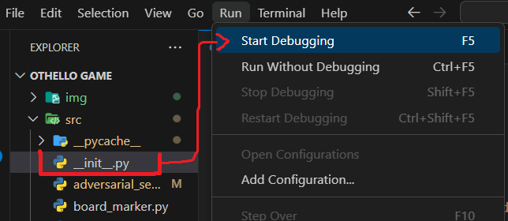

# Rules of the Game "Othello"

## 👋 Table of contents

- [Python Environment and Program Execution](#python-environment-and-program-execution)
- [Starting Rules](#starting-rules)
- [Game Rules](#game-rules)
- [Strategies](#strategies)

## 🐍 Python Environment and Program Execution
We worked with the following version of the Python language, to avoid compilation errors or missing packages:

[download the requested version](https://www.python.org/downloads/release/python-3112/)

Download the project:
1) cloning the repository to a certain address on your computer.
2) download it in the option "<> code... from there we select download ZIP" (then unzip it)

Now, simply to start the game we open the root folder of the project with the name "OTHELLO GAME"... then "src" and select the folder with the python extension named: __init__.py Finally, at the top of the options tab we select "RUN" -> "Start Debugging"

👀 NOTE: if it is the first time, it will ask you to select precisely the version of python that we have or install.

## 📜 Starting Rules

- For 2 players.
- 8x8 boards.
- 64 bicolored chips (two sides of different colors).

- Rows numbered 1 - 8.
- Columns named A - H.

- 32 chips for each player (black side for one and white side for the other).

### Initial Position

In the center of the board, place 4 pieces: 2 white and 2 black.

Where "b" represents a white chip and "n" represents a black chip.

## 💻 vs 👨‍🏫 Game Rules

- A token is placed only on a space so that it is adjacent to an opposing token and that opposing piece is "flanked" or "sandwiched" with another of our pieces.
- You can "flank" more than one piece, but you must at least "flank" one enemy piece.

The game ends when it is no longer possible for any player to make moves.

## 🤔 Strategies

There are strategies that can be applied to make moves that improve the results for a player.

This helps make our AI much more intelligent, without having to explore many state spaces of the game tree.

👉 [Check the instruction manual](https://service.mattel.com/instruction_sheets/B3165-SP.pdf) for more details about the game.

---

❤️‍🔥 Enjoy playing "Othello"!
